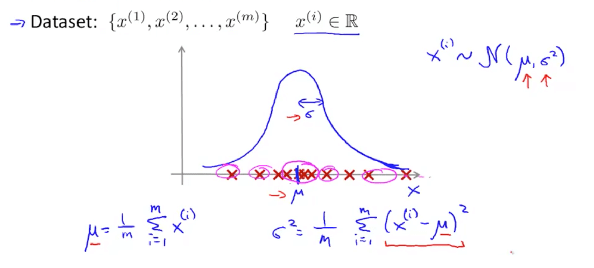

# Capstone Project
==============================
### What is Fraud Detection

Fraud detection is a problem that applicable in many industries including banks and financial sectors, insurance, government agencies and law enforcement. On the other hand, its becoming billion-dollar business ([2018 PWC](https://www.pwc.com/gx/en/forensics/global-economic-crime-and-fraud-survey-2018.pdf)), and it is increasing every year.

#### Some common Frauds:
- Credit Card Fraud
- Tax Fraud
- Fraud in Supply Chains, Retail networks, Purchase Department
- Fraud in Insurances
- Fraud in Healthcare

### Challenges in detecting Frauds
Information technology, business reengineering, reorganization or downsizing may weaken or eliminate control, while new information systems may present additional opportunities to commit fraud.

#### Traditional programming techniques
- Frequency between unsuccessful tries
- Registered customer's location like country, postcode or address
- 3D code in credit card payment
- other unusual behaviour that captured by human

#### Machine Learning techniques in Fraud Detection
One of the common technique to detect fraud in credit card payment is Anomaly Detection that used to identify unusual patterns that do not conform to expected behavior, called outliers. 

#### Other common usages of Anomaly Detection:
- Manufactoring
- Data Center 
- Airplane engine
- Website

### Some commong Machine Learning-based approaches for Anomaly Detection

- Density-Based Anomaly Detection (example: k-NN, LOF)
- Clustering-Based Anomaly Detection
- Support Vector Machine-Based Anomaly Detection
- Isolation Forest Anomaly Detection Algorithm

### Outlier vs Anamoly
Outlier: a value that you predictably find in your data that indicates your model does not work properly

Anomaly: a value that against all odds you find in your data that indicates your model does work properly

### Dataset
https://www.kaggle.com/mlg-ulb/creditcardfraud

Dataset is transformed Principal Component Analysis (PCA) which is commonly used:
- Dimensionality reduction algorithm
- Speed-up Machine Learning algorithms

#### Observation
- some features (V1, V2, V3, ... ,V28) transformed to PCA and Time, Amount features not transformed.
- target is Class (1-Fraud, 0-NonFraud)

### Modeling in Anomaly Detection
- Anomaly Detection using Gaussian Distribution  
  One of the main purposes of working on Capstone project is learning. So, personally, I am interested in Anomaly Detection technique taught by ***Andrew Ng***. It is simple, and easy to understand what Anomaly Detection is, and I am hoping that it will be my base knowledge to understand other ML algorithms. if you were interested in this course, please click [here](https://www.coursera.org/learn/machine-learning)
 
 ***For example:***

  ***Source***: https://www.ritchieng.com/machine-learning-anomaly-detection/
  
  
- SVN
- ISOlation forest
- clustering

Project Organization
------------

    ├── LICENSE
    ├── Makefile           <- Makefile with commands like `make data` or `make train`
    ├── README.md          <- The top-level README for developers using this project.
    ├── data
    │   ├── external       <- Data from third party sources.
    │   ├── interim        <- Intermediate data that has been transformed.
    │   ├── processed      <- The final, canonical data sets for modeling.
    │   └── raw            <- The original, immutable data dump.
    │
    ├── docs               <- A default Sphinx project; see sphinx-doc.org for details
    │
    ├── models             <- Trained and serialized models, model predictions, or model summaries
    │
    ├── notebooks          <- Jupyter notebooks. Naming convention is a number (for ordering),
    │                         the creator's initials, and a short `-` delimited description, e.g.
    │                         `1.0-jqp-initial-data-exploration`.
    │
    ├── references         <- Data dictionaries, manuals, and all other explanatory materials.
    │
    ├── reports            <- Generated analysis as HTML, PDF, LaTeX, etc.
    │   └── figures        <- Generated graphics and figures to be used in reporting
    │
    ├── requirements.txt   <- The requirements file for reproducing the analysis environment, e.g.
    │                         generated with `pip freeze > requirements.txt`
    │
    ├── setup.py           <- makes project pip installable (pip install -e .) so src can be imported
    ├── src                <- Source code for use in this project.
    │   ├── __init__.py    <- Makes src a Python module
    │   │
    │   ├── data           <- Scripts to download or generate data
    │   │   └── make_dataset.py
    │   │
    │   ├── features       <- Scripts to turn raw data into features for modeling
    │   │   └── build_features.py
    │   │
    │   ├── models         <- Scripts to train models and then use trained models to make
    │   │   │                 predictions
    │   │   ├── predict_model.py
    │   │   └── train_model.py
    │   │
    │   └── visualization  <- Scripts to create exploratory and results oriented visualizations
    │       └── visualize.py
    │
    └── tox.ini            <- tox file with settings for running tox; see tox.testrun.org

--------

<small>Project based on the <a target="_blank" href="https://drivendata.github.io/cookiecutter-data-science/">cookiecutter data science project template</a>. #cookiecutterdatascience</small>

